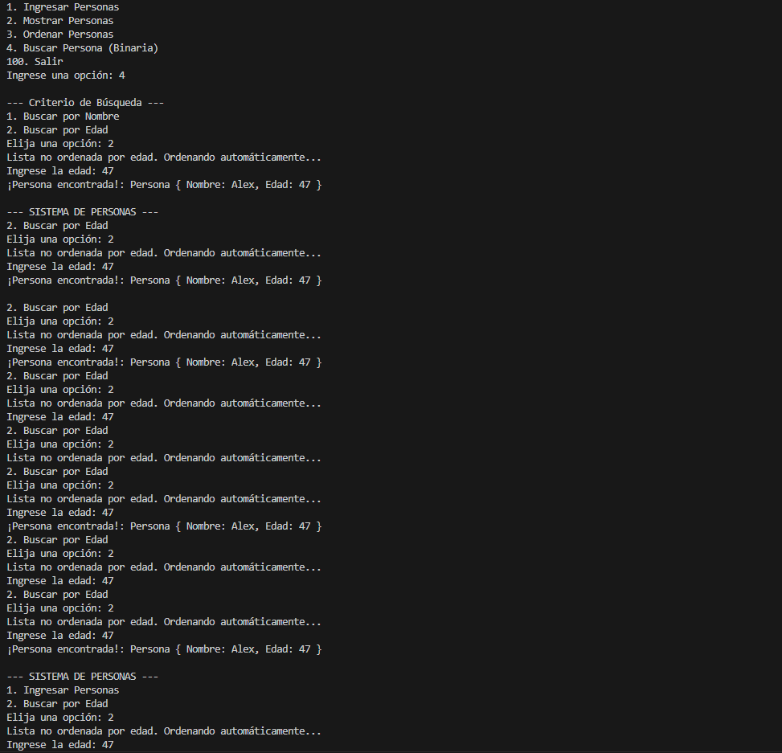
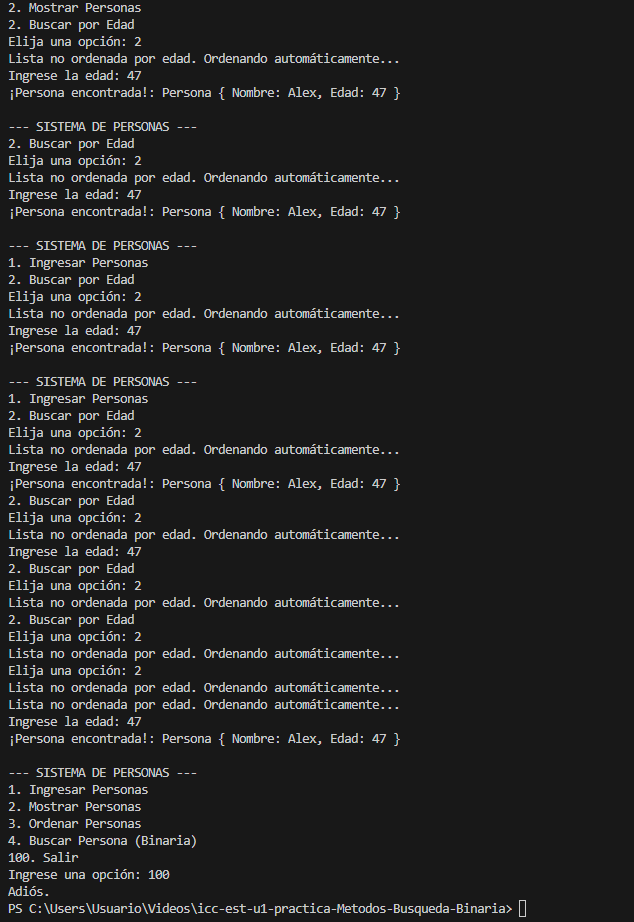

# Sistema de Personas (MVC)

***Martin Amaya*** 

Aplicación en Java para gestionar una lista de personas, implementando algoritmos de búsqueda y ordenamiento bajo el patrón **Modelo-Vista-Controlador**

##  Características Principales
* **Estructura MVC:** Separación lógica entre Modelo (`Person`), Vista (`View`) y Controlador (`Controller`).
* **Algoritmos de Ordenamiento:**
  * **Por Nombre:** Burbuja, Selección (Descendente) e Inserción.
  * **Por Edad:** Inserción.
* **Búsqueda Inteligente:** Búsqueda Binaria que detecta si la lista está desordenada y la ordena automáticamente antes de buscar.

1. **Compilacion:**
Part1
   
Part2
   
Part3   
   